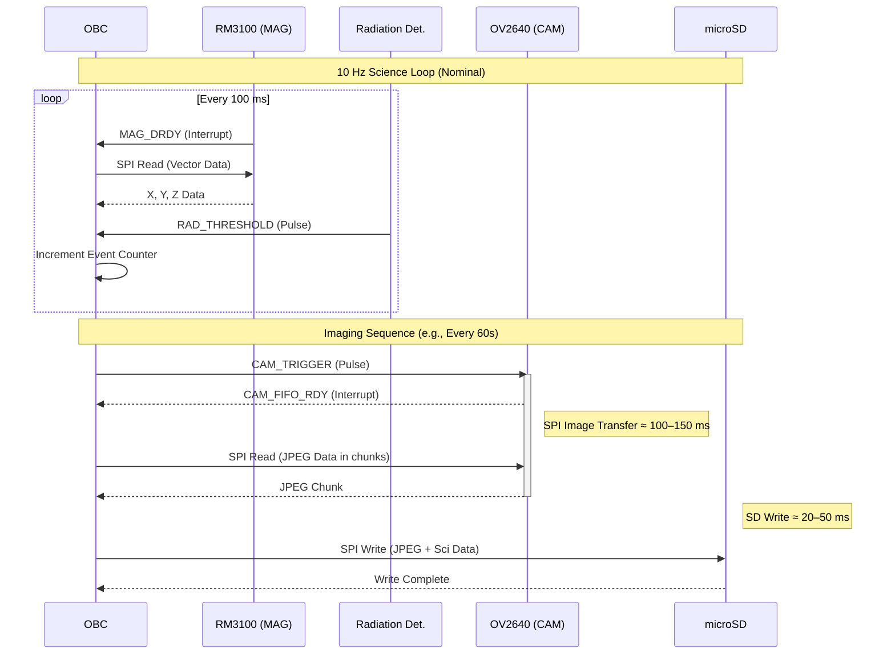
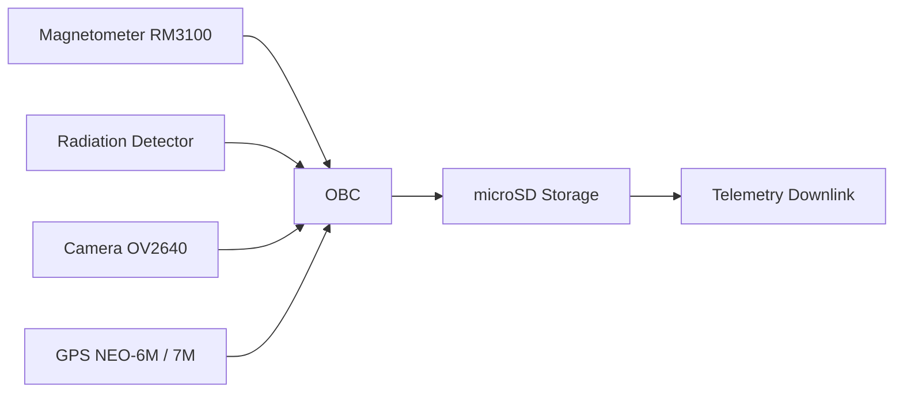
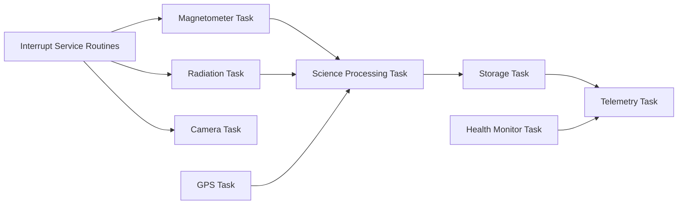

# ICD-PAYLOAD-001 — Payload Interface Control Document (ICD)

## 1. Scope

This document defines the electrical, logical, mechanical, and data interfaces between the Experimental Payload subsystem and the CubeSat On-Board Computer (OBC).

The payload includes three primary instruments:
- **Scientific magnetometer** based on the PNI RM3100 Magnetometer Sensor
- **Imaging system** based on the Arducam Mini Module Camera Shield with OV2640 2MP
- **Radiation detector** based on the Hamamatsu S1223-01 PIN Photodiode with analog front-end using the OPA134 Operational Amplifier

Supporting subsystems include:
- **Local storage** via microSD
- **Position and time reference** using the u-blox NEO-6M GNSS Module or u-blox NEO-7M GNSS Module

---

## 2. Payload Subsystems

| Subsystem | Function |
| :--- | :--- |
| **Magnetometer** | Vector magnetic field measurement |
| **Camera** | Earth observation imaging |
| **Radiation Detector** | Ionizing particle detection |
| **GPS** | Time and position reference |
| **Data Storage** | Buffering of scientific data |

---

## 3. Electrical Interfaces

### 3.1 Power Interface

| Rail | Voltage | Max Current | Source | Notes |
| :--- | :--- | :--- | :--- | :--- |
| **PAYLOAD_3V3** | 3.3 V ±5% | 250 mA peak | EPS/OBC | Main payload supply |
| **ANALOG_3V3** | 3.3 V | 20 mA | LDO filtered | Radiation front-end |
| **GPS_3V3** | 3.3 V | 50 mA | Payload rail | Active during tracking |

**Total payload peak consumption:**
- 180–220 mA @ 3.3 V
- ≈ 0.7 W

**Recommended decoupling:**
- 100 nF ceramic + 10 µF bulk per subsystem

---

## 4. Data Interfaces

### 4.1 SPI Bus

SPI0 bus shared between payload devices and onboard flash.

**Devices on SPI0:**
- Magnetometer (RM3100)
- Camera (OV2640)
- Flash storage (W25Q64)

| Signal | Direction | Description |
| :--- | :--- | :--- |
| **SPI_MOSI** | OBC → Payload | Master Out Slave In |
| **SPI_MISO** | Payload → OBC | Master In Slave Out |
| **SPI_SCK** | OBC → Payload | SPI clock |
| **SPI_CS_CAM** | OBC → Camera | Camera chip select |
| **SPI_CS_MAG** | OBC → Magnetometer | Magnetometer chip select |
| **SPI_CS_SD** | OBC → Storage | microSD chip select |

**SPI electrical characteristics:**

| Parameter | Value |
| :--- | :--- |
| **Logic level** | 3.3 V CMOS |
| **Clock frequency** | 10–20 MHz |
| **Mode** | SPI Mode 0 |

### 4.2 UART Interface (GPS)

Used for GNSS communication.

| Signal | Direction |
| :--- | :--- |
| **UART_TX** | OBC → GPS |
| **UART_RX** | GPS → OBC |

| Parameter | Value |
| :--- | :--- |
| **Default baud rate** | 9600 bps |
| **Supported baud** | 9600–115200 bps |
| **Protocol** | NMEA / UBX |

**Optional signal:**

| Signal | Description |
| :--- | :--- |
| **GPS_PPS** | 1 Hz timing reference |

### 4.3 Analog Interface (Radiation Detector)

The radiation detector produces analog pulses proportional to ionizing particle events.

**Signal chain:**
PIN Photodiode → Transimpedance Amplifier → Pulse shaping → ADC

**Interface to OBC ADC:**

| Signal | Type |
| :--- | :--- |
| **RAD_SIGNAL** | Analog input |
| **RAD_THRESHOLD** | Optional digital comparator |

**ADC requirements:**

| Parameter | Value |
| :--- | :--- |
| **Resolution** | ≥12 bit |
| **Sampling rate** | ≥50 kHz |
| **Input range** | 0–3.3 V |

---

## 5. Control Signals

| Signal | Direction | Description |
| :--- | :--- | :--- |
| **CAM_RESET** | OBC → Camera | Hardware reset |
| **CAM_TRIGGER** | OBC → Camera | Image capture trigger |
| **MAG_DRDY** | Magnetometer → OBC | Data ready interrupt |
| **GPS_PPS** | GPS → OBC | 1 Hz reference |

*Interrupt signals should be connected to OBC GPIO with interrupt capability.*

---

## 6. Data Products

| Instrument | Data type | Typical size |
| :--- | :--- | :--- |
| **Magnetometer** | Vector (X,Y,Z) | 12 bytes |
| **Camera** | JPEG image | 100–300 KB |
| **Radiation detector** | Event counter | few bytes |
| **GPS** | NMEA frame | ~100 bytes |

---

## 7. Data Rate Estimate

| Instrument | Rate |
| :--- | :--- |
| **Magnetometer** | 10 Hz |
| **Camera** | 1 image / 60–120 s |
| **Radiation detector** | event driven |
| **GPS** | 1 Hz |

**Estimated average data rate:**
- <10 kB/s

**Compatible with:**
- onboard storage
- UHF CubeSat downlink

---

## 8. Mechanical Interface

Payload electronics mounted within the CubeSat internal stack.

**Typical configuration:**
Top panel
│
Camera module
│
Payload PCB
│
OBC
│
EPS

**Magnetometer placement:**

| Requirement | Value |
| :--- | :--- |
| **Distance from DC-DC converters** | ≥5 cm |
| **Preferred location** | deployable boom or satellite corner |

---

## 9. Operational Modes

| Mode | Description |
| :--- | :--- |
| **Standby** | Payload powered but idle |
| **Science** | Magnetometer + radiation detector active |
| **Imaging** | Camera acquisition sequence |
| **Calibration** | Magnetometer bias calibration |

---

## 10. Fault Protection

Fault detection implemented in OBC software.

**Fault triggers:**
- SPI communication timeout
- GPS signal loss
- ADC saturation
- Camera FIFO error

**System response:**
- Payload reset
or
- Transition to Safe Mode

---

## 11. Pin Mapping Table — OBC ↔ Payload

### 11.1 SPI Bus Mapping

Shared SPI0 bus between camera, magnetometer, and flash storage.

| Signal | OBC Pin | Payload Device | Device Pin | Direction | Notes |
| :--- | :--- | :--- | :--- | :--- | :--- |
| **SPI_MOSI** | GPIO19 | Camera / Mag / Flash | MOSI | OBC → Payload | Shared SPI0 bus |
| **SPI_MISO** | GPIO17 | Camera / Mag / Flash | MISO | Payload → OBC | Shared SPI0 bus — changed from GPIO16 (now MTQ Z) |
| **SPI_SCK** | GPIO18 | Camera / Mag / Flash | SCK | OBC → Payload | Shared SPI0 clock |
| **SPI_CS_CAM** | GPIO14 | Camera | CS | OBC → Camera | Camera chip select — changed from GPIO23 (unavailable on Pico 2W) |
| **SPI_CS_MAG** | GPIO6 | Magnetometer | CS | OBC → Sensor | Magnetometer chip select |
| **SPI_CS_FLASH** | GPIO7 | Flash (W25Q64) | CS | OBC → Storage | Flash chip select (replaces microSD) |

**SPI Mode:**
- Mode 0

**SPI Max Clock:**
- 1 MHz (init) / 10 MHz (data transfer)

### 11.2 Camera Control Signals

Camera based on 8-pin Arducam Mini OV2640 2MP module (SPI + I2C only).
Camera registers configured via I2C1 (GPIO2 SDA, GPIO3 SCL). Image data transferred via SPI0.
No dedicated RESET, TRIG, or FIFO_RDY pins — reset via SCCB software register (0x12 = 0x80),
capture trigger via SPI ARDUCHIP_FIFO register, completion polled via ARDUCHIP_STATUS (0x07, bit 0).

| Signal | OBC Pin | Camera Pin | Direction | Notes |
| :--- | :--- | :--- | :--- | :--- |
| **SPI_CS_CAM**| GPIO14 | CS | OBC → Camera | SPI chip select (active low) |
| **SPI_MOSI** | GPIO19 | MOSI | OBC → Camera | SPI data to camera |
| **SPI_MISO** | GPIO17 | MISO | Camera → OBC | SPI data from camera |
| **SPI_SCK** | GPIO18 | SCK | OBC → Camera | SPI clock (≤ 10 MHz) |
| **CAM_SDA** | GPIO2 | SDA | OBC ↔ Camera | I2C1 data (SCCB register config) |
| **CAM_SCL** | GPIO3 | SCL | OBC ↔ Camera | I2C1 clock (SCCB register config) |

### 11.3 Magnetometer Interface

Magnetometer based on PNI RM3100 Magnetometer Sensor.

| Signal | OBC Pin | Sensor Pin | Direction | Notes |
| :--- | :--- | :--- | :--- | :--- |
| **SPI_CS_MAG** | GPIO6 | CS | OBC → Sensor | SPI select |
| **MAG_DRDY** | GPIO11 | DRDY | Sensor → OBC | Data ready interrupt |

### 11.4 GPS Interface

GNSS module based on u-blox NEO-6M GNSS Module or u-blox NEO-7M GNSS Module.

| Signal | OBC Pin | GPS Pin | Direction | Notes |
| :--- | :--- | :--- | :--- | :--- |
| **UART_TX** | GPIO0 | RX | OBC → GPS | NMEA commands |
| **UART_RX** | GPIO1 | TX | GPS → OBC | NMEA data |
| **GPS_PPS** | GPIO12 | PPS | GPS → OBC | 1 Hz timing |

**UART Configuration:**
- 9600 bps
- 8N1

### 11.5 Radiation Detector Interface

Detector based on Hamamatsu S1223-01 PIN Photodiode with OPA134 Operational Amplifier.

| Signal | OBC Pin | Type | Direction | Notes |
| :--- | :--- | :--- | :--- | :--- |
| **RAD_SIGNAL** | ADC2 (GPIO28)| Analog | Payload → OBC | Pulse measurement |
| **RAD_THRESHOLD**| GPIO13 | Digital | Payload → OBC | Comparator interrupt |

**ADC Configuration:**
- 12-bit resolution
- 50–100 kHz sampling

### 11.6 Power Pins

| Signal | Source | Destination | Notes |
| :--- | :--- | :--- | :--- |
| **PAYLOAD_3V3** | EPS/OBC | Payload PCB | Main supply |
| **GND** | OBC | Payload | Common ground |

### 11.7 Reserved Pins

_(All previously reserved GPIOs have been allocated — see Section 11.8 for current usage.)_

### 11.8 Summary of OBC Pin Usage

| Interface | Pins Used |
| :--- | :--- |
| **SPI** | GPIO17, 18, 19 |
| **Chip Selects** | GPIO6, 7, 23 |
| **Camera Control** | GPIO10, 22, 24 |
| **Camera I2C Config** | GPIO2, 3 |
| **Magnetometer IRQ** | GPIO11 |
| **GPS** | GPIO0, 1, 12 |
| **Radiation Detector** | GPIO13, 28 |
| **Magnetorquer PWM** | GPIO14, 15, 16 (non-payload) |

**Total payload pins used:**
- 12 GPIO (payload only)
- 1 ADC

*GPIO14/15/16 allocated to magnetorquers (ADCS subsystem). See ICD-OBC-001 for full pinout.*

### 11.9 OBC Pinout Allocation Diagram

OBC based on RP2350 MCU (Raspberry Pi Pico 2W).

```text
                    OBC MCU (RP2350 / Pico 2W)
                  ┌──────────────────────────────────┐
                  │                                  │
 UART0_TX  →      │ GPIO0   ────────────── GPS RX    │
 UART0_RX  ←      │ GPIO1   ────────────── GPS TX    │
                  │                                  │
 I2C1_SDA  ↔      │ GPIO2   ────────────── Camera I2C Config
 I2C1_SCL  ↔      │ GPIO3   ────────────── Camera I2C Config
                  │                                  │
 I2C0_SDA  ↔      │ GPIO4   ────────────── IMU (MPU6050) SDA
 I2C0_SCL  ↔      │ GPIO5   ────────────── IMU (MPU6050) SCL
                  │                                  │
 SPI_CS_MAG →     │ GPIO6   ────────────── RM3100 CS
 SPI_CS_FLASH →   │ GPIO7   ────────────── Flash (W25Q64) CS
                  │                                  │
 UART1_TX   →     │ GPIO8   ────────────── HC-12 Radio RX
 UART1_RX   ←     │ GPIO9   ────────────── HC-12 Radio TX
                  │                                  │
  RW1_PWM     →    │ GPIO10  ────────────── Reaction Wheel 1
  MAG_DRDY    ←    │ GPIO11  ────────────── Magnetometer DRDY ⚠️ shared RW2_PWM
  GPS_PPS     ←    │ GPIO12  ────────────── GPS 1PPS ⚠️ shared RW3_PWM
  RAD_IRQ     ←    │ GPIO13  ────────────── Radiation Comparator
                   │                                  │
  SPI_CS_CAM  →    │ GPIO14  ────────────── Camera CS (8-pin module, SPI+I2C only)
  MAG_Y_PWM   →    │ GPIO15  ────────────── Magnetorquer Y PWM
  MAG_Z_PWM   →    │ GPIO16  ────────────── Magnetorquer Z PWM
                   │                                  │
  SPI_MISO    ←    │ GPIO17  ────────────── SPI0 Bus
  SPI_SCK     →    │ GPIO18  ────────────── SPI0 Bus
  SPI_MOSI    →    │ GPIO19  ────────────── SPI0 Bus
                   │                                  │
  WDT_KICK    →    │ GPIO20  ────────────── External Watchdog
                   │                                  │
  PAYLOAD_ENABLE → │ GPIO21  ────────────── Payload 5V rail enable
  MAG_X_PWM   →    │ GPIO22  ────────────── Magnetorquer X PWM
                  │                                  │
 RAD_SIGNAL  ←    │ GPIO28 (ADC2) ──────── Radiation Analog Signal
                  │                                  │
                  └──────────────────────────────────┘
```

### 11.10 Bus Allocation Summary

| Bus | Devices |
| :--- | :--- |
| **SPI0** | Camera, Magnetometer, Flash (W25Q64) |
| **UART0** | GPS |
| **UART1** | HC-12 Radio (TT&C) |
| **I2C0** | IMU (MPU6050) |
| **I2C1** | Camera register configuration (OV2640) |
| **ADC** | Radiation detector (ADC2 / GPIO28) |
| **GPIO Interrupts** | Camera, Magnetometer, GPS, Radiation |

### 11.11 GPIO Usage Summary

| Resource | Usage |
| :--- | :--- |
| **Total payload GPIO used** | 12 |
| **SPI data pins** | 3 (GPIO17/18/19) |
| **SPI chip selects** | 3 (GPIO6/7/23) |
| **Interrupt lines** | 4 (GPIO10/11/12/13) |
| **Analog inputs** | 1 (GPIO28) |
| **Camera control** | 2 (GPIO22/24) |
| **Camera I2C config** | 2 (GPIO2/3) |
| **Payload enable** | 1 (GPIO21) |

*The RP2350 has 30 GPIOs, leaving ample margin for future expansion.*

### 11.12 Reserved for Future Payload Expansion

_(GPIO15 now allocated to magnetorquer Y; GPIO21 to PAYLOAD_ENABLE; GPIO22 to CAM_TRIGGER.
No unreserved GPIOs remain for payload expansion on the current OBC pinout.
See ICD-OBC-001 for the complete system-level GPIO allocation.)_

---

### 11.13 Payload Power Budget

| Instrument / Subsystem | Voltage (V) | Nominal Current (mA) | Peak Current (mA) | Nominal Power (mW) | Peak Power (mW) | Duty Cycle | Average Power (mW) |
| :--- | :--- | :--- | :--- | :--- | :--- | :--- | :--- |
| **Magnetometer (RM3100)** | 3.3 | 2.5 | 5.0 | 8.25 | 16.5 | 100% | 8.25 |
| **Camera (OV2640 + SPI)** | 3.3 | 60 | 120 | 198 | 396 | <1% | ~2 |
| **Radiation Detector** | 3.3 | 15 | 20 | 49.5 | 66 | 100% | 49.5 |
| **GPS (NEO-6M / 7M)** | 3.3 | 35 | 50 | 115.5 | 165 | 50% | 57.75 |
| **microSD Storage** | 3.3 | 10 | 100 | 33 | 330 | 5% | 1.65 |
| **TOTAL** | 3.3 | **122.5 mA** | **295 mA** | **404.25 mW** | **973.5 mW** | — | **119.15 mW** |

#### Payload Power Summary

| Metric | Value |
| :--- | :--- |
| **Average payload power** | ~0.12 W |
| **Nominal instantaneous power** | ~0.40 W |
| **Worst-case peak power** | ~0.97 W |

#### Recommended EPS design margin

Typical CubeSat margin:
- **Power Margin = 20–30%**

So EPS should support:
- **~1.3 W payload peak capability**

#### Operational constraint
> **Camera acquisition and SD write operations shall not overlap with GPS cold-start events.**
> This avoids a peak of: 120 + 100 + 50 ≈ 270 mA.

*Note: The camera and microSD card are the primary drivers of peak power consumption. Operating them concurrently should be avoided if mitigating high inrush currents is required.*

---

### 11.14 Payload Timing Diagram

Typical science acquisition and imaging sequence driven by the OBC.



#### Camera Data Transfer Estimate

**OV2640 JPEG typical size:**
- 100–300 KB

**SPI clock:**
- 20 MHz

**Transfer approximation:**
- 200 KB / (2.5 MB/s) ≈ 80 ms
- *Plus overhead:* ~120–150 ms
- **SPI Image Read ≈ 150 ms**

---

## 11.15 Payload Data Flow Architecture

The payload data flow architecture defines the path followed by scientific data from sensors to onboard storage and eventual downlink through the communication subsystem.

The **On-Board Computer (OBC)** acts as the central node responsible for:
- sensor acquisition
- data buffering
- file generation
- storage management
- telemetry packaging

Primary sensors in the payload include:
- Magnetometer based on the PNI RM3100 Magnetometer Sensor
- Imaging system based on the Arducam Mini Module Camera Shield with OV2640 2MP
- Radiation detector using the Hamamatsu S1223-01 PIN Photodiode and OPA134 Operational Amplifier

Navigation data is provided by the u-blox NEO-6M GNSS Module or u-blox NEO-7M GNSS Module.

### 11.15.1 High-Level Data Flow



### 11.15.2 Data Flow Description

#### Magnetometer Data Path
1. Magnetometer generates measurement ready interrupt (MAG_DRDY).
2. OBC reads vector data through SPI.
3. Measurement is timestamped.
4. Data stored in science buffer.

Typical payload packet:
`Timestamp | Bx | By | Bz`

#### Radiation Detector Data Path
1. Radiation event produces analog pulse.
2. Analog front-end converts signal to measurable pulse.
3. OBC ADC samples pulse or receives comparator interrupt.
4. Event counter incremented.
5. Stored data format:

`Timestamp | Event Count`

#### Camera Data Path
1. OBC triggers image capture.
2. Camera stores image in FIFO.
3. OBC reads JPEG data via SPI.
4. Image written to storage.

Typical file format:
`IMG_YYYYMMDD_HHMMSS.JPG`

#### GPS Data Path
1. GPS continuously outputs NMEA frames over UART.
2. OBC parses:
   - position
   - time
   - satellite status
3. Timestamp used to synchronize science data.

Example data fields:
- UTC Time
- Latitude
- Longitude
- Altitude

### 11.15.3 Data Buffering Strategy

To avoid blocking operations, the OBC maintains separate buffers:

| Buffer | Purpose |
| :--- | :--- |
| **Magnetometer buffer** | High rate sensor data |
| **Radiation counter** | Event accumulation |
| **Camera buffer** | Image transfer staging |
| **Telemetry queue** | Downlink packets |

Recommended architecture:
`ISR → Sensor Queue → Processing Task → Storage Task`

### 11.15.4 Data Storage Structure

Scientific data stored on microSD using a hierarchical structure.

Example layout:
```text
/data
   /mag
      mag_log_001.csv
   /rad
      rad_log_001.csv
   /img
      IMG_0001.JPG
```

### 11.15.5 Telemetry Interface

Downlink subsystem periodically retrieves data from storage.


### 11.15.6 Data Integrity Measures

To ensure reliability:
- CRC added to telemetry packets
- periodic file system sync
- watchdog monitoring of storage tasks

Recommended telemetry packet structure:
`Header | Timestamp | Payload Data | CRC`

---

## 11.16 Payload Software Architecture (FreeRTOS Tasks)

The payload software architecture is implemented using **FreeRTOS** running on the On-Board Computer (OBC).
The system follows a **task-based architecture** where each payload function is handled by a dedicated task or interrupt service routine (ISR).

This design ensures:
- deterministic sensor acquisition
- non-blocking camera transfers
- safe storage operations
- separation between real-time acquisition and slower I/O operations

### 11.16.1 Software Architecture Overview



### 11.16.2 Interrupt Service Routines (ISR)

Several payload events are interrupt-driven to minimize latency.

| Interrupt Source | Signal | Function |
| :--- | :--- | :--- |
| **Magnetometer** | MAG_DRDY | Indicates new magnetic field measurement |
| **Camera** | CAM_FIFO_RDY | Indicates image data available |
| **Radiation Detector** | RAD_THRESHOLD | Indicates ionizing event |
| **GPS** | GPS_PPS | Provides 1 Hz timing reference |

ISR responsibilities are limited to:
- timestamp capture
- queue signaling
- event notification to tasks

*Heavy processing is deferred to FreeRTOS tasks.*

### 11.16.3 Sensor Acquisition Tasks

#### Magnetometer Task
- **Responsibilities:** handle `MAG_DRDY` interrupt notifications, read vector data via SPI, push measurements to processing queue
- **Typical rate:** 10 Hz

#### Radiation Detector Task
- **Responsibilities:** process event interrupts, maintain event counters, periodically send summary data to processing task
- **Typical resolution:** single-event counting

#### GPS Task
- **Responsibilities:** parse NMEA frames from UART, maintain system timestamp, provide time reference to science data
- **Typical rate:** 1 Hz

#### Camera Task
- **Responsibilities:** initiate capture sequence, wait for FIFO ready interrupt, read JPEG image via SPI, transfer image to storage buffer
- **Image acquisition frequency:** 1 image every 60–120 seconds

### 11.16.4 Science Processing Task

This task performs lightweight processing and data packaging.

- **Responsibilities:** timestamp sensor measurements, convert raw data to engineering units, aggregate sensor data, prepare storage packets
- **Typical packet structure:** `Timestamp | Sensor ID | Data | CRC`

### 11.16.5 Storage Task

Responsible for managing the microSD file system.

- **Responsibilities:** write science data to files, manage directory structure, perform periodic file system sync
- **Storage operations include:** CSV logging for sensor data, JPEG storage for images

Example structure:
```text
/data
   /mag
   /rad
   /img
```

### 11.16.6 Telemetry Task

Handles preparation of downlink telemetry packets.

- **Responsibilities:** read data from storage or memory buffers, assemble telemetry frames, send packets to communication subsystem
- **Typical telemetry packet:** `Header | Timestamp | Payload Data | CRC`

### 11.16.7 Health Monitoring Task

Ensures payload system reliability.

- **Responsibilities:** monitor task execution timing, detect communication failures, supervise sensor status, reset subsystems if required
- **Typical checks include:** SPI timeout detection, GPS signal loss, storage errors, ADC saturation

### 11.16.8 Task Scheduling Summary

| Task | Priority | Typical Period |
| :--- | :--- | :--- |
| **Magnetometer Task** | High | 100 ms |
| **Radiation Task** | High | Event-driven |
| **GPS Task** | Medium | 1 s |
| **Camera Task** | Medium | On demand |
| **Science Processing Task** | Medium | 100 ms |
| **Storage Task** | Low | As needed |
| **Telemetry Task** | Low | 1–10 s |
| **Health Monitor Task** | Low | 1 s |

### 11.16.9 Design Considerations

Key design principles include:
- interrupt-driven sensor acquisition
- separation between real-time acquisition and storage I/O
- priority scheduling to ensure sensor data integrity
- watchdog supervision for fault recovery

*This architecture ensures reliable operation within the resource constraints of the CubeSat OBC.*

---

## 11.17 Payload Operational Concept (OPS-CON)

The Payload Operational Concept (OPS-CON) describes how the payload subsystem is used during nominal mission operations.

The payload is operated by the On-Board Computer (OBC), which schedules data acquisition, storage, and telemetry transmission according to mission timelines and available power resources.

Primary payload instruments include:
- Magnetometer based on the PNI RM3100 Magnetometer Sensor
- Imaging system based on the Arducam Mini Module Camera Shield with OV2640 2MP
- Radiation detector based on the Hamamatsu S1223-01 PIN Photodiode with OPA134 analog front-end
- Position and time reference provided by the u-blox NEO-6M / NEO-7M GNSS module

Payload operation is organized into several operational modes.

### 11.17.1 Payload Operational Modes

| Mode | Description |
| :--- | :--- |
| **Safe Mode** | Payload powered off or minimal activity to conserve power and recover from faults |
| **Standby Mode** | Payload powered but sensors inactive |
| **Science Mode** | Magnetometer and radiation detector actively collecting data |
| **Imaging Mode** | Camera capture sequence initiated |
| **Downlink Mode** | Stored scientific data transmitted to ground station |

### 11.17.2 Nominal Science Operation

During nominal operations the payload runs a continuous science acquisition loop.

Typical sequence:
1. Magnetometer samples magnetic field vector at **10 Hz**
2. Radiation detector counts ionizing events
3. GPS provides timestamp and orbital reference
4. Science data buffered in OBC memory
5. Data periodically written to microSD storage

Nominal science data packet structure:
`Timestamp | Sensor ID | Data | CRC`

### 11.17.3 Imaging Operation

Earth imaging operations are performed periodically or on command.

Typical sequence:
1. OBC enters **Imaging Mode**
2. Camera capture triggered
3. Image stored in camera FIFO
4. OBC retrieves JPEG image via SPI
5. Image written to microSD storage

Typical image acquisition rate:
`1 image every 60–120 seconds`

Images are stored using timestamp-based filenames:
`IMG_YYYYMMDD_HHMMSS.JPG`

### 11.17.4 Data Storage Operations

Scientific data is stored locally before transmission.

Data types stored:

| Data Type | Storage Format |
| :--- | :--- |
| **Magnetometer data** | CSV log files |
| **Radiation counts** | CSV log files |
| **Images** | JPEG files |
| **GPS logs** | NMEA or parsed CSV |

Example storage structure:
```text
/data
   /mag
   /rad
   /img
   /gps
```

### 11.17.5 Telemetry and Downlink

Stored payload data is periodically transmitted to the ground station.

Telemetry flow:
1. OBC retrieves data from storage
2. Data packaged into telemetry frames
3. Frames transmitted through communication subsystem
4. Ground station reconstructs science data

Typical telemetry packet:
`Header | Timestamp | Payload Data | CRC`

### 11.17.6 Fault Handling

The payload system includes basic fault detection and recovery mechanisms.

Potential faults include:
- SPI communication timeout
- Camera acquisition failure
- GPS signal loss
- microSD write errors
- ADC saturation

Typical recovery actions:

| Fault | Response |
| :--- | :--- |
| **Sensor communication failure** | Sensor reset |
| **Storage error** | Retry write operation |
| **Camera failure** | Abort capture and reset camera |
| **Critical system fault** | Enter Safe Mode |

### 11.17.7 Power-Aware Operations

Payload operations are constrained by available spacecraft power.

Operational guidelines:
- Imaging operations should not overlap with high-power system events.
- Camera and microSD operations should be scheduled sequentially.
- GPS cold start events should be avoided during camera capture.

Typical operational constraint:
> **Camera acquisition and SD write operations shall not overlap with GPS cold-start events.**

### 11.17.8 Mission Data Lifecycle

The lifecycle of payload data follows these stages:

1. **Acquisition** – sensors generate scientific data
2. **Processing** – OBC timestamps and packages measurements
3. **Storage** – data written to microSD
4. **Telemetry** – data downlinked to ground station
5. **Analysis** – science data processed on the ground

`Sensors → OBC Processing → Storage → Telemetry → Ground Station`

---

## 12. Verification and Validation Plan (V&V)

The Verification and Validation (V&V) plan defines the strategy used to confirm that the payload subsystem meets all functional and performance requirements.

Verification activities ensure that the system has been **built correctly**, while validation confirms that the system **fulfills the mission objectives**.

The verification process follows standard space engineering practices consistent with the guidelines of ECSS.

### 12.1 Verification Strategy

Verification will be performed using a combination of the following methods:

| Method | Description |
| :--- | :--- |
| **Inspection (I)** | Verification through documentation review or visual inspection |
| **Analysis (A)** | Mathematical analysis, simulation, or modeling |
| **Test (T)** | Functional testing using hardware or software |
| **Demonstration (D)** | Operational demonstration of subsystem functionality |

Most payload requirements will be verified through **functional testing** and **hardware-in-the-loop simulations**.

### 12.2 Verification Matrix

Each payload requirement is mapped to a verification method.

| Requirement ID | Requirement Description | Verification Method |
| :--- | :--- | :--- |
| **PAY-REQ-001** | Magnetometer shall measure magnetic field vector at 10 Hz | Test |
| **PAY-REQ-002** | Radiation detector shall count ionizing events | Test |
| **PAY-REQ-003** | Camera shall capture JPEG images | Test |
| **PAY-REQ-004** | Payload shall store science data on microSD | Test |
| **PAY-REQ-005** | Payload shall timestamp data using GPS time | Demonstration |
| **PAY-REQ-006** | Payload shall operate within power budget | Analysis |
| **PAY-REQ-007** | Payload software shall run under FreeRTOS task scheduler | Inspection + Test |

### 12.3 Unit Testing

Unit tests validate individual software modules.

Examples include:

| Module | Test Objective |
| :--- | :--- |
| **SPI Driver** | Verify communication with sensors |
| **Camera Driver** | Validate image acquisition |
| **GPS Parser** | Verify NMEA message decoding |
| **Storage Driver** | Validate microSD read/write operations |
| **Radiation Counter** | Verify interrupt-based event counting |

Unit tests will be executed on the development platform before subsystem integration.

### 12.4 Hardware Integration Tests

Integration tests verify correct operation when hardware components are connected together.

Integration steps:
1. OBC + SPI bus validation
2. Magnetometer communication test
3. Radiation detector signal acquisition
4. Camera image capture test
5. microSD storage validation
6. GPS synchronization test

Expected outputs:
- sensor data streams
- image files stored on SD
- valid timestamp synchronization

### 12.5 Hardware-in-the-Loop Testing (HIL)

Hardware-in-the-loop tests simulate mission conditions while operating real hardware.

The test setup includes:
- OBC running FreeRTOS
- connected payload sensors
- simulated spacecraft telemetry interface
- ground test computer

HIL tests validate:
- real-time acquisition loops
- task scheduling
- interrupt handling
- data storage reliability

### 12.6 Environmental Testing (Optional for Academic Missions)

Although full qualification testing may not be required for an academic CubeSat, basic environmental tests are recommended.

Possible tests include:

| Test | Purpose |
| :--- | :--- |
| **Thermal cycling** | Validate sensor performance across temperature range |
| **Vibration test** | Validate mechanical integrity |
| **Power cycling** | Verify boot reliability |
| **Long-duration operation** | Detect memory leaks or stability issues |

### 12.7 End-to-End Mission Simulation

An end-to-end mission simulation validates the full payload data pipeline.

Test sequence:
1. Sensors generate science data
2. OBC processes and timestamps measurements
3. Data stored on microSD
4. Telemetry packets generated
5. Ground station receives and reconstructs data

This test validates the **complete science data lifecycle**.

### 12.8 Acceptance Criteria

The payload subsystem will be considered validated if the following conditions are met:
- All sensors produce valid data
- Camera successfully captures images
- Data stored without corruption
- System operates within power constraints
- FreeRTOS tasks run without timing violations
- Telemetry packets correctly formatted

### 12.9 Verification Documentation

All verification activities will be documented in the following artifacts:

| Document | Purpose |
| :--- | :--- |
| **Test Procedures** | Define how each test is executed |
| **Test Reports** | Record results of verification tests |
| **Verification Matrix** | Trace requirements to tests |
| **Integration Logs** | Record hardware integration activities |

These documents will be maintained as part of the project engineering documentation set.

---

## 13. Risk Assessment

This section identifies potential technical risks associated with the payload subsystem and defines mitigation strategies.

Risk management is an ongoing process throughout the project lifecycle and aims to:
- identify technical risks early
- evaluate probability and mission impact
- define mitigation strategies
- track risk status during development

### 13.1 Risk Classification

Risks are evaluated using a qualitative matrix based on **probability** and **impact**.

#### Probability Levels

| Level | Description |
| :--- | :--- |
| **Low** | Unlikely to occur |
| **Medium**| Possible during mission |
| **High** | Likely to occur |

#### Impact Levels

| Level | Description |
| :--- | :--- |
| **Low** | Minor performance degradation |
| **Medium**| Partial payload functionality loss |
| **High** | Loss of payload science capability |

### 13.2 Risk Matrix

| Risk ID | Description | Probability | Impact | Risk Level | Mitigation Strategy |
| :--- | :--- | :--- | :--- | :--- | :--- |
| **PAY-RISK-001** | Camera SPI communication failure | Medium | Medium | Medium | Implement SPI timeout detection and retry logic |
| **PAY-RISK-002** | microSD corruption due to power interruption | Medium | High | High | Use buffered writes and periodic filesystem sync |
| **PAY-RISK-003** | Radiation detector noise or false triggers | Medium | Medium | Medium | Implement threshold filtering and signal conditioning |
| **PAY-RISK-004** | Magnetometer interference from spacecraft electronics | Medium | Medium | Medium | Place sensor away from high-current components |
| **PAY-RISK-005** | GPS signal loss in orbit | High | Low | Medium | Use internal system clock fallback |
| **PAY-RISK-006** | Excessive peak power during camera capture | Low | High | Medium | Schedule camera and SD operations sequentially |
| **PAY-RISK-007** | Software task deadlock or timing violation | Low | High | Medium | Use watchdog and health monitoring tasks |
| **PAY-RISK-008** | Storage capacity exhaustion | Medium | Low | Low | Implement file rotation and downlink prioritization |

### 13.3 Risk Mitigation Strategies

Several design strategies are used to reduce mission risk.

#### Software Fault Tolerance

Software mitigation techniques include:
- watchdog timers
- task health monitoring
- communication timeout detection
- retry mechanisms for SPI transactions

These mechanisms allow the system to recover automatically from transient faults.

#### Power Management

To avoid power-related failures:
- high-power operations are scheduled sequentially
- camera capture and microSD writes are not performed simultaneously
- power consumption remains within spacecraft limits

#### Data Integrity Protection

To prevent corruption of science data:
- all telemetry packets include CRC validation
- filesystem synchronization performed periodically
- critical operations verified after completion

#### Hardware Layout Considerations

Payload hardware layout will consider electromagnetic compatibility:
- magnetometer positioned away from switching regulators
- analog front-end isolated from digital buses
- sensor wiring minimized to reduce noise pickup

### 13.4 Risk Monitoring

Risks will be reviewed periodically during development phases:

| Review Phase | Purpose |
| :--- | :--- |
| **Preliminary Design Review (PDR)** | Identify major design risks |
| **Critical Design Review (CDR)** | Confirm risk mitigation strategies |
| **Integration Phase** | Detect hardware/software integration issues |
| **System Testing** | Validate mitigation effectiveness |

### 13.5 Residual Risk

After mitigation strategies are applied, remaining risks are considered **acceptable for an academic CubeSat mission**.

These risks will be monitored during mission operations.

---

## 14. Payload Data Products Specification

This section defines the scientific data products generated by the payload subsystem, including their structure, format, and expected data rates.

Payload data products are generated by the onboard sensors and processed by the On-Board Computer (OBC). The data is stored locally and periodically transmitted to the ground station.

Primary payload data sources include:
- Magnetometer measurements
- Radiation detector event counts
- Camera images
- GPS timing and position data

### 14.1 Data Product Overview

| Data Product | Source Instrument | Format | Typical Rate |
| :--- | :--- | :--- | :--- |
| **Magnetic field vectors** | Magnetometer | Binary / CSV | 10 Hz |
| **Radiation event counts** | Radiation detector | Binary / CSV | Event-driven |
| **Images** | Camera | JPEG | Every 60–120 s |
| **Time and position** | GPS module | NMEA / parsed data | 1 Hz |

### 14.2 Magnetometer Data Format

Magnetometer measurements consist of a three-axis magnetic field vector.

Typical structure:
`Timestamp | Bx | By | Bz | Temperature | CRC`

| Field | Description |
| :--- | :--- |
| **Timestamp** | GPS-synchronized system time |
| **Bx** | Magnetic field X component |
| **By** | Magnetic field Y component |
| **Bz** | Magnetic field Z component |
| **Temperature** | Sensor internal temperature |
| **CRC** | Data integrity check |

Typical sampling rate:
`10 samples per second`

Estimated data size:
- ~24 bytes per sample
- ~240 bytes per second

### 14.3 Radiation Detector Data Format

Radiation events are counted using the PIN diode detection circuit.

Two types of data may be generated:

#### Event Counter Mode
`Timestamp | Event_Count | CRC`

#### Pulse Event Mode (optional)
`Timestamp | Pulse_Amplitude | CRC`

Typical data rate:
- event-driven
- typically low bandwidth

Estimated average data rate:
- < 50 bytes per second

### 14.4 Camera Image Data

Images are captured using the onboard camera module.

Image format:
`JPEG (compressed)`

Typical resolution:
`1600 × 1200 pixels`

Typical file size:
- 100–300 KB depending on compression settings.

Image file naming convention:
`IMG_YYYYMMDD_HHMMSS.JPG`

### 14.5 GPS Data

The GPS module provides timing and position information.

Typical data fields:
`Timestamp | Latitude | Longitude | Altitude | Fix_Quality | CRC`

Update rate:
`1 Hz`

This data is primarily used for:
- timestamp synchronization
- orbit reconstruction
- geolocation of images

### 14.6 Telemetry Packet Format

Payload data transmitted to the ground station is packaged into telemetry frames.

Generic telemetry structure:
`Packet_Header | Timestamp | Payload_ID | Data_Length | Payload_Data | CRC`

| Field | Description |
| :--- | :--- |
| **Packet Header** | Synchronization marker |
| **Timestamp** | GPS or system time |
| **Payload ID** | Identifier of sensor data |
| **Data Length** | Payload data size |
| **Payload Data** | Scientific measurement |
| **CRC** | Error detection |

### 14.7 Estimated Data Volume

Typical daily data generation estimate:

| Data Type | Estimated Daily Volume |
| :--- | :--- |
| **Magnetometer data** | ~20 MB |
| **Radiation data** | ~5 MB |
| **Images** | ~50–150 MB |
| **GPS logs** | ~1 MB |

Estimated total:
`~75–175 MB per day`

*Actual downlink volume will depend on communication bandwidth and mission scheduling.*

### 14.8 Data Processing on Ground

After downlink, payload data will be processed by the ground segment.

Processing steps include:
1. Telemetry frame decoding
2. CRC validation
3. Data reconstruction
4. Science data formatting
5. Archival storage

Typical ground data pipeline:
`Telemetry → Decoder → Science Database → Analysis Tools`

### 14.9 Data Archival

All scientific data will be archived for post-mission analysis.

Archive formats may include:
- CSV files for sensor data
- JPEG images for visual payload data
- mission logs for operational events

Data archives should include metadata such as:
- acquisition timestamp
- spacecraft state
- sensor configuration

---

## 15. Payload Calibration Plan

This section describes the calibration procedures required to ensure accurate measurements from the payload sensors.

Calibration activities will be performed during the **ground testing phase** prior to spacecraft integration. The objective is to characterize sensor response and remove systematic measurement errors.

Payload sensors requiring calibration include:
- Magnetometer
- Radiation detector
- Camera imaging system
- GPS timing reference

### 15.1 Magnetometer Calibration

The magnetometer measures the spacecraft's magnetic field vector. Accurate calibration is necessary to remove sensor bias and scale errors.

#### Calibration Objectives
- Determine **sensor bias (offset)**
- Correct **scale factor errors**
- Identify **axis misalignment**

#### Calibration Procedure
1. Place the spacecraft or sensor board in a **magnetically clean environment**
2. Rotate the sensor through multiple orientations
3. Record raw magnetic field vectors
4. Fit measurements to a **sphere/ellipsoid model**
5. Compute calibration parameters

Typical calibration model:
`B_corrected = M * (B_raw - B_bias)`

Where:

| Parameter | Description |
| :--- | :--- |
| **B_raw** | Raw magnetometer vector |
| **B_bias** | Sensor offset |
| **M** | Calibration matrix |

Calibration parameters will be stored in the OBC configuration.

### 15.2 Radiation Detector Calibration

The radiation detector uses a **PIN photodiode and analog front-end** to detect ionizing radiation events.

#### Calibration Objectives
- Verify detector sensitivity
- Determine event detection threshold
- Characterize noise level

#### Calibration Procedure
1. Operate detector in dark environment
2. Measure baseline noise level
3. Apply known radiation source (if available)
4. Adjust detection threshold

Calibration parameters include:

| Parameter | Purpose |
| :--- | :--- |
| **Detection threshold** | Noise rejection |
| **Gain factor** | Signal scaling |
| **Event filter parameters** | False trigger suppression |

### 15.3 Camera Calibration

The camera system requires basic optical calibration.

#### Calibration Objectives
- Verify image acquisition
- Adjust exposure parameters
- Characterize optical distortion

#### Calibration Tests

| Test | Purpose |
| :--- | :--- |
| **Flat field test** | Detect sensor non-uniformity |
| **Exposure adjustment** | Optimize brightness |
| **Focus verification** | Confirm optical focus |

Camera configuration parameters may include:
- JPEG compression quality
- exposure time
- white balance settings

### 15.4 GPS Time Synchronization

The GPS module provides accurate timing for science data.

#### Calibration Goals
- Verify correct parsing of NMEA messages
- Validate timestamp synchronization
- Confirm PPS signal accuracy

Verification steps:
1. Compare GPS timestamp with reference clock
2. Verify PPS interrupt timing
3. Confirm timestamp accuracy in stored data

Expected accuracy:
`< 1 millisecond relative timing error`

### 15.5 Calibration Data Storage

Calibration parameters will be stored in the spacecraft configuration.

Example configuration structure:
```text
/config
   magnetometer_calibration.json
   radiation_thresholds.json
   camera_settings.json
```

These parameters are loaded by the payload software during system initialization.

---

## 16. Payload Mass Budget

This section estimates the total mass of the payload subsystem.

Mass estimation is necessary to ensure compliance with spacecraft mechanical constraints and launch requirements.

### 16.1 Payload Component Mass

| Component | Model | Estimated Mass |
| :--- | :--- | :--- |
| **Magnetometer** | PNI RM3100 breakout | ~5 g |
| **Camera module** | Arducam Mini OV2640 | ~6 g |
| **Radiation detector** | PIN diode + TIA board | ~8 g |
| **GPS module** | NEO-6M / NEO-7M | ~16 g |
| **microSD module** | SPI microSD breakout | ~4 g |
| **microSD card** | 2 GB SDHC | ~2 g |
| **Connectors and wiring** | — | ~15 g |

### 16.2 Structural Mounting

Additional structural components are required to mount the payload hardware.

| Component | Estimated Mass |
| :--- | :--- |
| **Payload mounting plate** | ~20 g |
| **Fasteners** | ~5 g |
| **Standoffs** | ~5 g |

### 16.3 Total Payload Mass Estimate

| Category | Mass |
| :--- | :--- |
| **Electronics** | ~41 g |
| **Wiring and connectors** | ~15 g |
| **Structural mounting** | ~30 g |

Estimated payload total mass:
`~86 grams`

### 16.4 Mass Margin

Engineering margin is applied to account for uncertainties.

Typical margin:
`+20%`

Adjusted payload mass estimate:
`~103 grams`

### 16.5 Compliance with CubeSat Constraints

The estimated payload mass is well within the limits for a typical CubeSat payload subsystem.

This leaves margin for:
- additional shielding
- improved mounting hardware
- potential sensor upgrades
